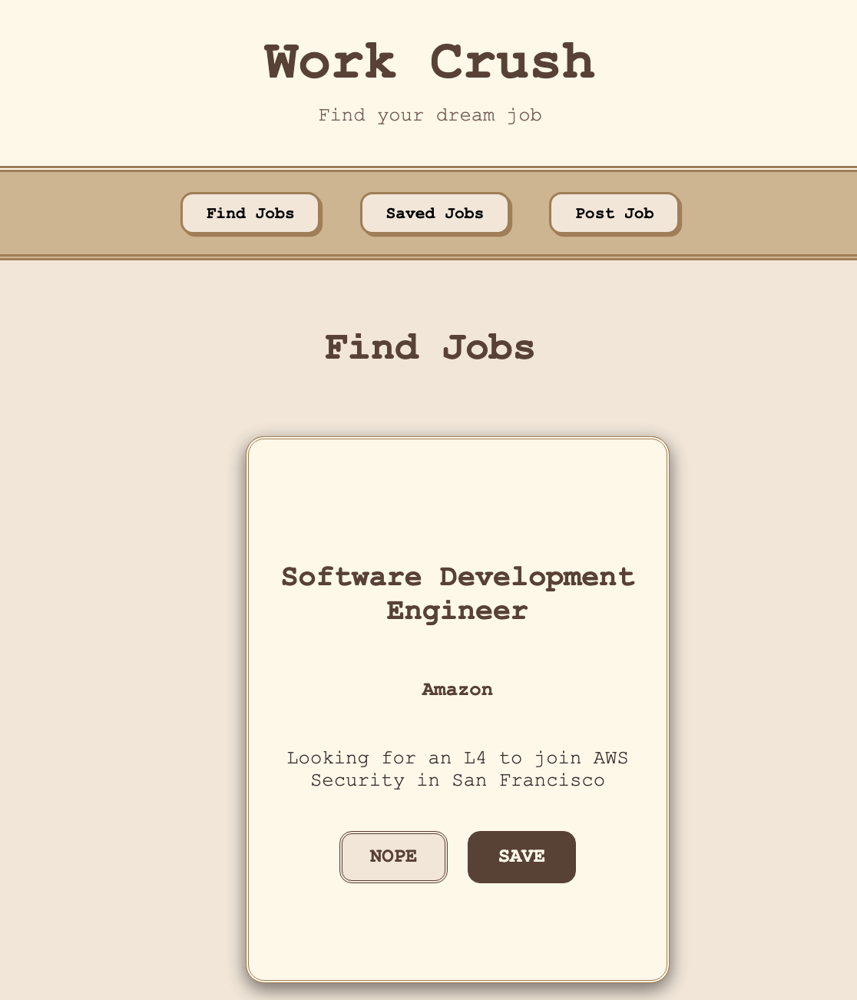

# Work Crush Frontend



This is the **frontend** for the Work Crush application — a full-stack, vintage-themed job browsing platform where users can swipe to save or reject job listings.

Built with **React**, styled with a **retro vintage aesthetic**, and structured for responsive mobile-friendly use.

---

## 📚 Features

- Swipe-based job browsing interface (inspired by Tinder)
- Save jobs or remove them with action buttons
- Post new job listings
- View saved jobs separately
- Dynamic page routing with **React Router**
- Mobile-responsive design with flexible Flexbox layout
- REST API integration with backend server
- Vintage, retro-themed UI built from scratch

---

## 🚀 Technologies Used

- React.js
- React Router DOM
- Axios (for HTTP requests)
- CSS Flexbox and Media Queries
- react-tinder-card (for swipeable cards)
- Node.js (for backend server API)

---

## 📂 Project Structure

```
/work-crush-frontend
  ├── src/
      ├── api/
          └── apiJobClient.js   # Axios client for backend communication
      ├── components/
          ├── FindJobs.js      # Swipe-based job browsing page
          ├── SavedJobs.js     # Saved jobs list
          ├── PostJob.js       # Job posting form
          ├── Header.js        # Top site header
          └── Footer.js        # Bottom site footer
      ├── App.js               # Main app with routing
      ├── index.css             # Global CSS styling
      └── index.js              # React entry point
  ├── public/
      └── index.html
  ├── package.json
```

---

## 🔧 Setup Instructions

1. **Install dependencies:**

```bash
cd work-crush-frontend
npm install
```

2. **Start the development server:**

```bash
npm start
```

Frontend will start at:

```
http://localhost:3000
```

✅ Make sure your backend is running at `http://localhost:9000` for API requests to work.

---

## 🌐 Environment Configuration

Currently, the frontend uses **hardcoded Axios base URLs** pointed at:

```javascript
http://localhost:9000
```

---

## 📡 API Endpoints Used

| Method | Endpoint            | Purpose                         |
|:-------|:---------------------|:--------------------------------|
| GET    | `/jobs`              | Fetch available jobs           |
| POST   | `/jobs`              | Add new job posting            |
| DELETE | `/jobs/:id`          | Delete a job listing           |
| GET    | `/saved-jobs`        | Fetch saved jobs               |
| POST   | `/saved-jobs`        | Save a job                     |
| DELETE | `/saved-jobs/:id`    | Remove a saved job             |

✅ All API requests handled through `apiJobClient.js`.

---

---

## ✨ Visual Theme

The frontend uses a **vintage paper theme** with:

- Creamy backgrounds (`#f4e6d7`)
- Deep brown fonts (`#5c4033`)
- Retro button designs
- Subtle hover animations for interaction feedback

---

## 🛡️ Notes

- Designed for local development testing.
- If deployed, Axios base URLs should be updated accordingly.

---

## ✨ License

This project is open-source for learning and portfolio purposes.  
Feel free to fork and modify!